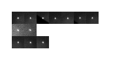

# imgCIF Tools

## `image_test.jl`

This program runs a series of tests on an imgCIF file. 

### Installation

1. [Install Julia](https://julialang.org/downloads) if you don't already have it.
2. Copy **all** `.jl` files and `Project.toml` from here to a convenient directory.
3. Run command `julia install_image_tests.jl` from that convenient directory.

See below for a way to speed up execution by about 50%.

### Updating

1. Overwrite all `.jl` files and `Project.toml` from step 2 above with
the latest copies from here.  
2. Delete the file `Manifest.toml` from the
same directory if present
3. Run the command `julia install_image_tests.jl`

### Fast execution

To create a precompiled library, which will save around 30s per run:

1. Edit the file [`precompile_routines.jl`](precompile_routines.jl) to include a locally-available imgCIF file and raw data
1. Install `PackageCompiler.jl`: at the Julia prompt, `]` and then `add PackageCompiler`
2. Exit the package interface (`Backspace` key)
3. At the prompt: `using PackageCompiler`
4. At the prompt: `create_sysimage(sysimage_path = <output>, precompile_execution_file = "precompile_routines.jl")`
5. Wait around 10 minutes!
6. When executing `image_tests.jl`, type `julia -J<output> image_tests.jl`

**You must rerun this after every update!**

### Usage

For help, run `julia image_tests.jl --help` after installation.

Note the `--sub <original_url> <local>` option (which may be repeated for multiple
urls) which links a local file with a remote URL that may be present in the imgCIF file
being checked. This
allows interactive preparation and checking of imgCIF descriptions and archive files without 
needing to download the whole archive each time the program is run. 

If `<local>` is a directory, it is treated as if it is the root of an already extracted
archive and individual archived files are searched for within it. For example, if an
archive has files `crystal_1/abcd_01_0001.cbf, crystal_1/abcd_01_0002.cbf,...` and
it is extracted into directory `/home/me/downloads`, creating a directory 
`/home/me/downloads/crystal_1`, `<local>` is `/home/me/downloads`. Files and 
directories not corresponding to entries in the imgCIF file will be ignored.

For rsync archives, `<original_url>` should contain only the
directories in the rsync URL that are unchanging for the whole
dataset, without trailing forward slash. So, for example, if the
remote URLs are of the form
`rsync://data.sbgrid.org/10.15785/SBGRID/952/X4_<nnn>.cbf`, then
`original_url` will be `rsync://data.sbgrid.org/10.15785/SBGRID/952`.

Note also for rsync that an empty or non-existent directory can be provided as
`<local>`, and it will be populated by rsync as images are accessed. This can
then be reused on subsequent runs without needing to re-download images.

### Examples

```
julia image_tests.jl tests/all_scans.cif
```

Run checks on `tests/all_scans.cif`, testing for the presence of any remote
archives but not downloading any images and not testing any images.

```
julia -Jprecomp_lib image_tests.jl tests/all_scans.cif
```

Run checks on `tests/all_scans.cif`, using a precompiled binary `precomp_lib`
to speed up processing.

```
julia image_tests.jl -i tests/all_scans.cif
```

Run checks on `tests/all_scans.cif`, including checks on the first image
found in the remote repository specified in `tests/all_scans.cif`,
with low-resolution printout to the terminal.

```
julia image_tests.jl -i -o -p 3 tests/all_scans.cif
```

As above, but use the 3rd image (`-p 3`) found in the archive instead of
the first image and output (`-o`) a test image to file instead of terminal.

```
julia image_tests.jl --skip -o -s https://zenodo.org/record/5886687/files/cbf_b4_1.tar.bz2 
/home/myself/downloads/cbf_b4_1.tar.bz2 b4_master_remote.cif
```

Do not verify imgCIF metadata (`--skip`), running tests only on the images
themselves, using 
local file `/home/myself/downloads/cbf_b4_1.tar.bz2` in place of 
`https://zenodo.org/record/5886687/files/cbf_b4_1.tar.bz2` whenever 
encountered in `b4_master_remote.cif` (`-s` option). Store test image in file
`b4_master_remote.cif.png` (`-o` option).

```
julia image_tests.jl --skip -o -s https://zenodo.org/record/5886687/files/cbf_b4_1.tar.bz2 
/home/myself/downloads b4_master_remote.cif
```
As above, except `cbf_b4_1.tar.bz2` contents are searched for in `/home/myself/downloads`
using the archived path.

```
julia image_tests.jl -s https://zenodo.org/record/12345/files/my_crystal2.tar.bz2 
/home/me/unpacked_data --skip -o --peaks my_crystal_2.cif
```
Create a peak check "fingerprint" to make sure axis orientations and settings are correct in
`my_crystal_2.cif`. Local directory `/home/me/unpacked_data` contains the unpacked contents of remote
location `https://zenodo.org/record/12345/files/my_crystal2.tar.bz2`. Non-image checks
are skipped.



```
JULIA_DEBUG=Main julia image_tests.jl <filename>
```
or
```
JULIA_DEBUG=ImgCIFHandler julia image_tests.jl <filename>
```

Provide extra debugging output during the run that may or may not help.
